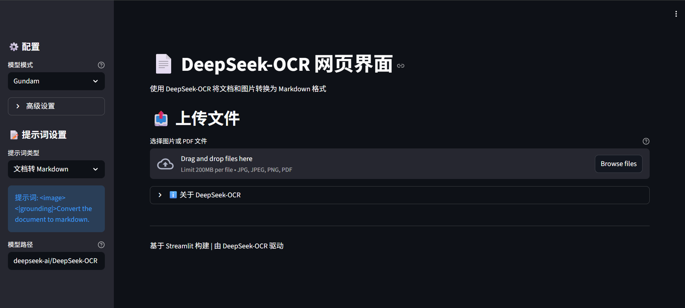

# DeepSeek-OCR Web Interface

A user-friendly Streamlit web interface for DeepSeek-OCR, enabling easy document and image conversion to markdown.



## Online Demo

[Xiangong Cloud Image](https://www.xiangongyun.com/image/detail/12bc7fec-c31a-401e-8034-38992c71fc1b)

## Features

- **Multiple File Support**: Process images (JPG, PNG) and PDF files
- **Batch Processing**: Upload and process multiple files at once
- **Model Modes**: Choose from Tiny, Small, Base, Large, or Gundam modes
- **Customizable Prompts**: Select from preset prompts or create custom ones
- **Advanced Settings**: Configure max crops, concurrency, and workers
- **Download Results**: Download individual results or all files as a ZIP

## Prerequisites

Before running the web interface, ensure you have:

1. **DeepSeek-OCR Environment**: Set up according to the original DeepSeek-OCR instructions
2. **Conda Environment**: Activate the `deepseek-ocr` conda environment
3. **Model Files**: DeepSeek-OCR model downloaded and accessible

## Installation

1. Navigate to your project directory:
```bash
cd /path/to/dpsk-ocr
```

2. Activate the DeepSeek-OCR conda environment:
```bash
conda activate deepseek-ocr
```

3. Install additional dependencies:
```bash
pip install streamlit
```

## Usage

### Starting the Web Interface

Run the following command to start the Streamlit app:

```bash
streamlit run app.py
```

The web interface will open in your default browser (typically at http://localhost:8501).

### Using the Interface

1. **Configure Settings** (Sidebar):
   - Select a **Model Mode**: Gundam (recommended for large documents), Tiny, Small, Base, or Large
   - Adjust **Advanced Settings** if needed (max crops, concurrency, workers)
   - Choose a **Prompt Type** or create a custom prompt
   - Verify the **Model Path** (default: `deepseek-ai/DeepSeek-OCR`)

2. **Upload Files**:
   - Click "Browse files" or drag-and-drop files
   - Supported formats: JPG, JPEG, PNG, PDF
   - Multiple files can be uploaded at once

3. **Process**:
   - Click "Start OCR Processing"
   - Wait for the processing to complete (progress bar will show status)
   - Model will be loaded on first run (this may take time)

4. **View Results**:
   - Results will appear below with previews
   - Download individual results or all files as a ZIP

## Model Modes

- **Tiny**: Fast processing for simple documents (512x512)
- **Small**: Balanced speed and accuracy (640x640)
- **Base**: Standard mode for most documents (1024x1024)
- **Large**: High accuracy for complex documents (1280x1280)
- **Gundam**: Optimized for large documents with cropping (1024 base, 640 image)

## Prompt Types

- **Document to Markdown**: Convert documents with layout preservation
- **OCR Image**: Extract text from images with structure
- **Free OCR (no layout)**: Extract text without layout information
- **Parse Figure**: Extract information from figures and charts
- **Describe Image**: Get detailed image descriptions
- **Custom**: Create your own prompt

## Tips

- For **large PDFs**: Consider using Gundam mode with lower concurrency if you have limited GPU memory
- For **best quality**: Use Base or Large mode
- For **fastest processing**: Use Tiny or Small mode
- **GPU Memory**: Reduce max crops (to 4-6) and concurrency if you encounter out-of-memory errors

## Output Files

Results are saved as markdown files (.mmd):
- `filename.mmd`: Processed output with clean markdown
- `filename_ori.mmd`: Original output with all reference tags
- For PDFs: `filename_det.mmd` contains detection information

## Troubleshooting

### Out of Memory Errors
- Reduce **Max Crops** to 4-6
- Lower **Max Concurrency** to 50 or less
- Use a smaller model mode (Tiny or Small)

### Model Loading Issues
- Ensure the DeepSeek-OCR model is properly installed
- Check the model path is correct
- Verify you're in the correct conda environment

### Slow Processing
- This is normal for large documents or high-quality modes
- Consider using batch processing for multiple files
- Use a smaller model mode for faster results

## File Structure

```
dpsk-ocr/
├── app.py                      # Streamlit web interface
├── config.py                   # Configuration file
├── run_dpsk_ocr_image.py      # Original image processing script
├── run_dpsk_ocr_pdf.py        # Original PDF processing script
├── requirements.txt            # Python dependencies
└── README.md                   # This file
```

## Advanced Configuration

The `config.py` file contains additional settings that can be modified:
- `MIN_CROPS`: Minimum number of crops (default: 2)
- `PRINT_NUM_VIS_TOKENS`: Print visual tokens count (default: False)
- `SKIP_REPEAT`: Skip pages without proper EOS token (default: True)

## License

This project uses DeepSeek-OCR. Please refer to the original DeepSeek-OCR license for usage terms.

## Credits

Built with:
- [Streamlit](https://streamlit.io/)
- [DeepSeek-OCR](https://github.com/deepseek-ai/DeepSeek-OCR)
- [vLLM](https://github.com/vllm-project/vllm)
